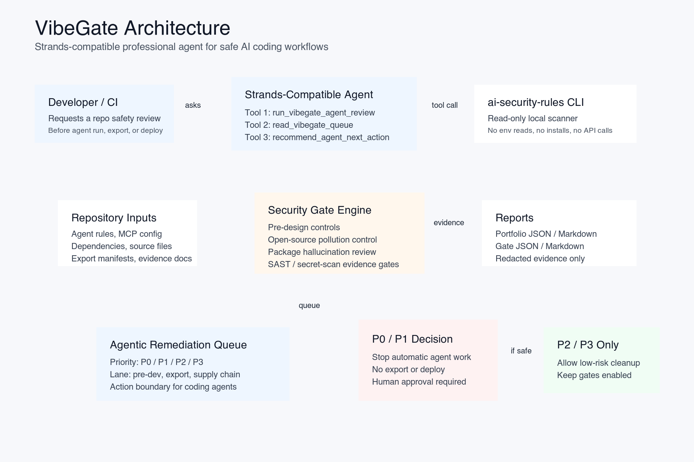
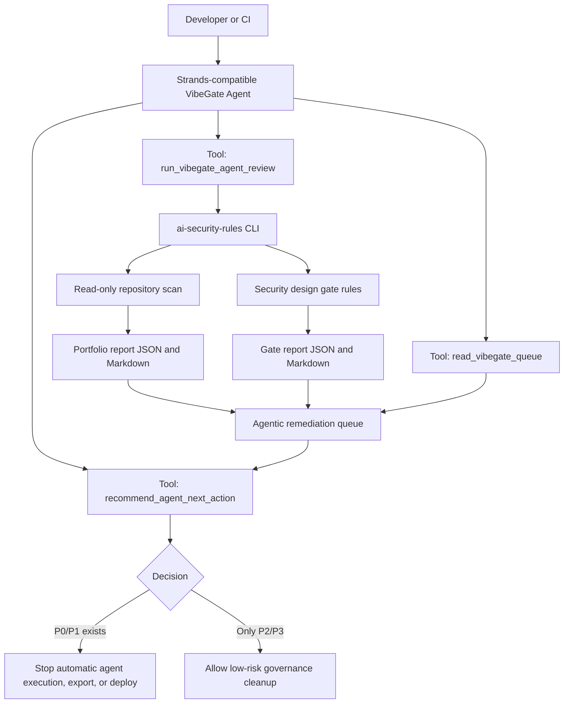

# Architecture

## VibeGate Agentic Security Gate

Devpost-uploadable diagram:

## Components

| Component | Role | Safety boundary |
|---|---|---|
| `ai_security_rules.cli` | Performs local scan and gate evaluation. | Does not read `.env` contents, execute target commands, install dependencies, or call provider APIs. |
| `security_design_gate_rules.json` | Defines stage gates and blocking controls. | Rules are static local JSON. |
| `agent-review` mode | Converts scan and gate findings into a remediation queue. | Queue contains redacted evidence and action boundaries, not secret values. |
| `strands_agent_demo/vibegate_strands_agent.py` | Strands-compatible wrapper with three tools. | Default deterministic dry-run needs no model provider or API key. |
| Reports | JSON and Markdown evidence for humans, agents, and CI. | Written only to `--output-dir`. |

## Data Flow

1. A developer or CI job starts the Strands-compatible wrapper.
2. The wrapper calls the local `agent-review` tool.
3. The scanner reads repository files except skipped sensitive patterns such as `.env*`.
4. The gate engine evaluates pre-design, pre-dependency, pre-agent-run, public-export, and deploy evidence rules.
5. The agent queue is generated with priority, lane, evidence, required action, and allowed agent boundary.
6. The wrapper recommends whether an AI coding agent must stop or may continue with low-risk work.

## Agent Boundary

The agent is not allowed to rotate credentials, delete files, publish a repository, deploy code, or override a gate. It may prepare patches, manifests, evidence templates, and low-risk documentation when the queue allows it.

## Agents for Humans Fit

VibeGate fits the Professional Agents track: it helps developers, maintainers, DevSecOps teams, and small engineering teams handle repetitive, judgment-heavy security review before AI coding agents work on a repo.
