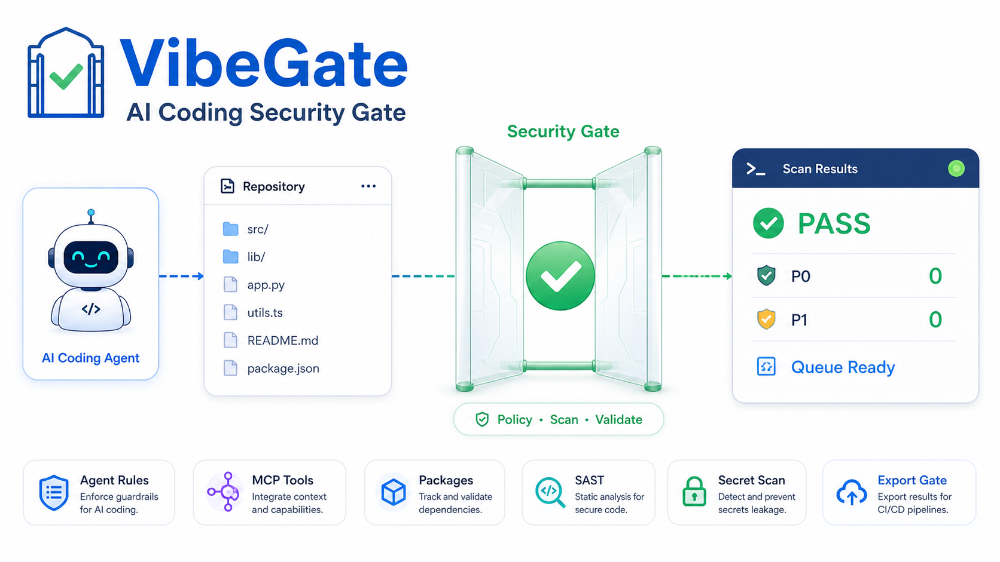
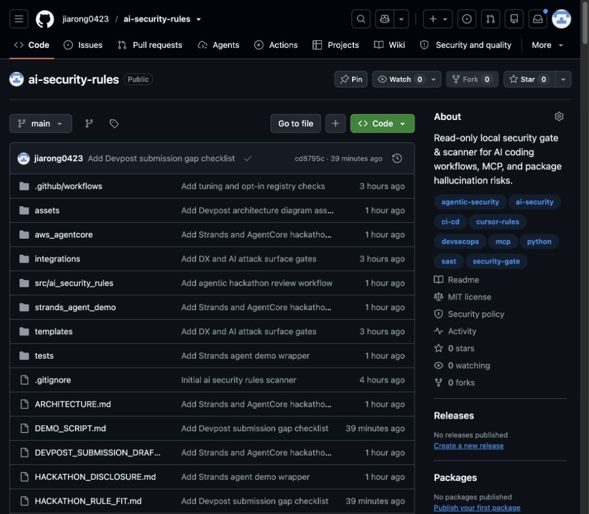
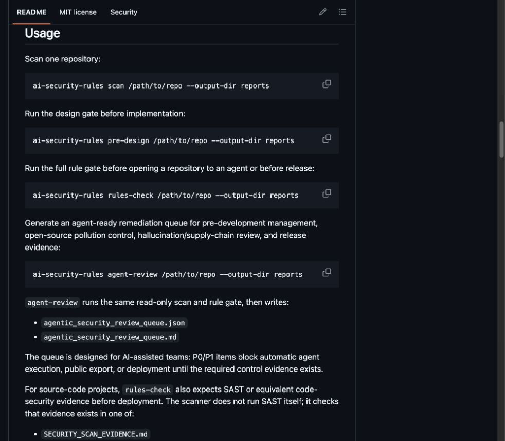
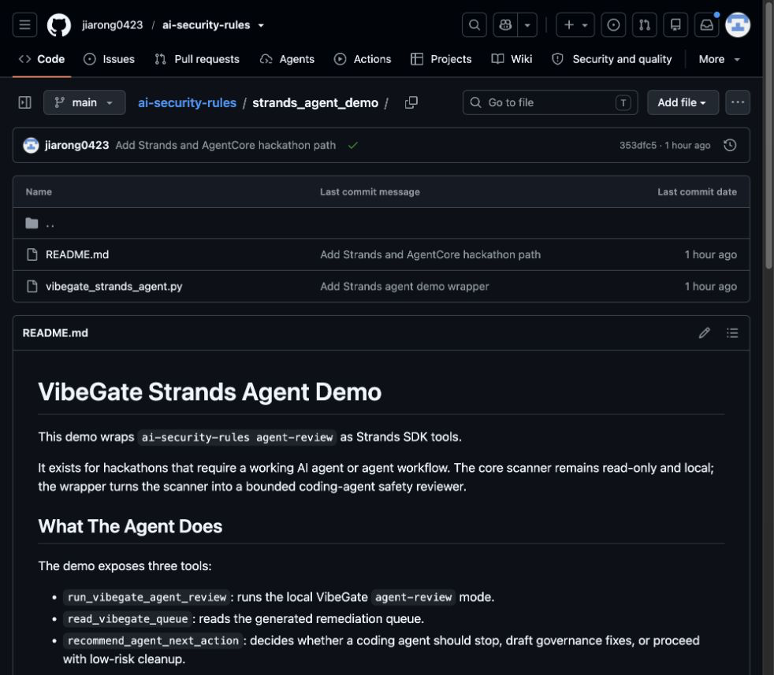
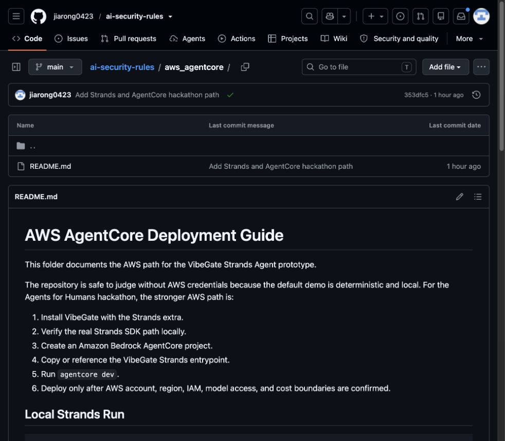
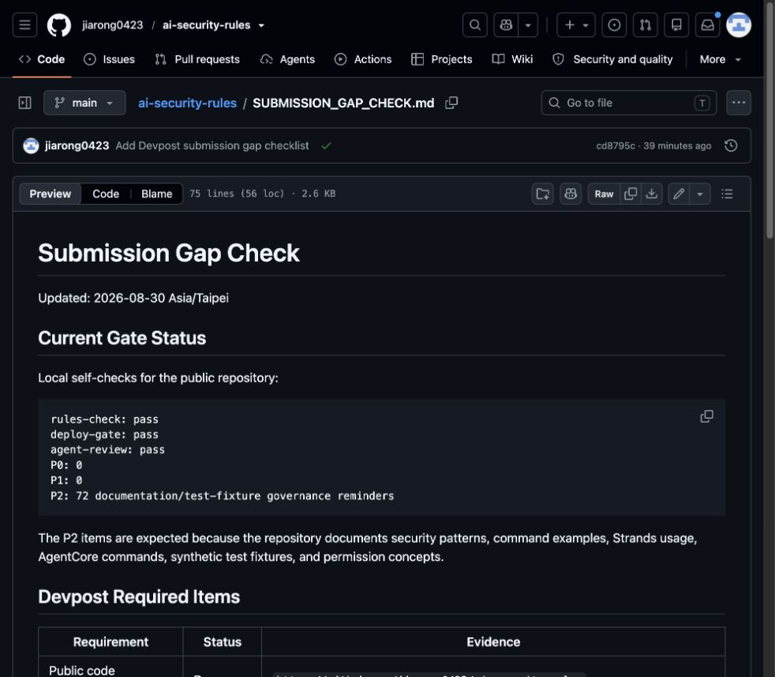
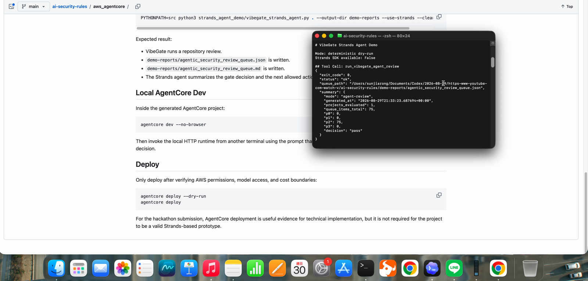
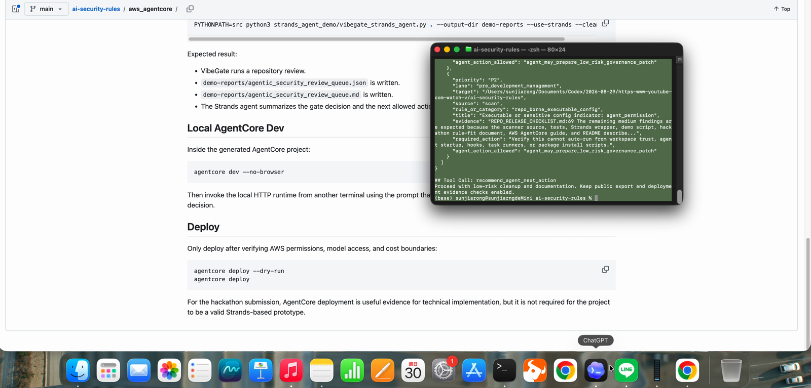

# ai-security-rules

Read-only local scanner and gate for AI coding security risks.

The tool focuses on security surfaces that are easy to miss in agentic coding workflows:

- agent-readable files such as `AGENTS.md`, `CLAUDE.md`, `SKILL.md`, `.mcp.json`, `.claude/`, `.cursor/`, `.gemini/`, and `.vscode/`;
- repo-borne executable config such as shell commands, package runners, install hooks, process spawning, and network fetches;
- secret exposure indicators without printing secret values;
- package hallucination and slopsquatting watchlist hits;
- public-export gates for demo packages, release bundles, and copied repositories.
- prompt-injection indicators in agent-readable files, including invisible Unicode control characters;
- over-privileged MCP configuration indicators such as `sudo`, root filesystem scope, home-directory scope, and wildcard network access.

## Safety Guarantees

- Does not read `.env` or `.env.*` contents.
- Does not print secret values.
- Does not execute project commands.
- Does not install dependencies.
- Does not modify the scanned project.
- Does not call provider APIs.
- Does not call the network unless `--registry-check` is explicitly enabled.
- Writes reports only to `--output-dir`.

## Install

From a local checkout:

```bash
python3 -m pip install .
```

For development without installation:

```bash
PYTHONPATH=src python3 -m ai_security_rules --help
```

## Usage

Scan one repository:

```bash
ai-security-rules scan /path/to/repo --output-dir reports
```

Run the design gate before implementation:

```bash
ai-security-rules pre-design /path/to/repo --output-dir reports
```

Run the full rule gate before opening a repository to an agent or before release:

```bash
ai-security-rules rules-check /path/to/repo --output-dir reports
```

Generate an agent-ready remediation queue for pre-development management, open-source pollution control, hallucination/supply-chain review, and release evidence:

```bash
ai-security-rules agent-review /path/to/repo --output-dir reports
```

`agent-review` runs the same read-only scan and rule gate, then writes:

- `agentic_security_review_queue.json`
- `agentic_security_review_queue.md`

The queue is designed for AI-assisted teams: P0/P1 items block automatic agent execution, public export, or deployment until the required control evidence exists.

## Demo Screenshots


















For source-code projects, `rules-check` also expects SAST or equivalent code-security evidence before deployment. The scanner does not run SAST itself; it checks that evidence exists in one of:

- `SECURITY_SCAN_EVIDENCE.md`
- `SAST_EVIDENCE.md`
- `CODE_SECURITY_EVIDENCE.md`

Run the public export gate on a generated package or release directory:

```bash
ai-security-rules export-gate /path/to/public-package --output-dir reports
```

Run the deployment evidence gate:

```bash
ai-security-rules deploy-gate /path/to/repo --output-dir reports
```

`deploy-gate` checks release evidence for source-code and dependency-bearing projects:

- SAST/code-security evidence: `SECURITY_SCAN_EVIDENCE.md`, `SAST_EVIDENCE.md`, or `CODE_SECURITY_EVIDENCE.md`
- secret-scan evidence: `SECRET_SCAN_EVIDENCE.md`, `GITLEAKS_EVIDENCE.md`, or `TRUFFLEHOG_EVIDENCE.md`
- package reputation evidence: `PACKAGE_REPUTATION_EVIDENCE.md`, `DEPENDENCY_REPUTATION_EVIDENCE.md`, or `LOCKFILE_REVIEW_EVIDENCE.md`

Evidence files are checked for freshness with a default max age of 30 days:

```bash
ai-security-rules deploy-gate /path/to/repo --evidence-max-age-days 14 --output-dir reports
```

Scan current files plus local git history:

```bash
ai-security-rules history-scan /path/to/repo --output-dir reports
```

Apply reviewed false-positive tuning for low/medium noise only:

```bash
ai-security-rules scan /path/to/repo --tuning ./ai-security-rules-tuning.example.json --output-dir reports
```

Run opt-in package registry existence checks for npm/PyPI dependencies:

```bash
ai-security-rules scan /path/to/repo --registry-check --output-dir reports
```

Copy integration templates into another repository:

```bash
cp templates/pre-commit-config.yaml /path/to/repo/.pre-commit-config.yaml
cp templates/github-actions-ai-gate.yml /path/to/repo/.github/workflows/ai-gate.yml
```

The legacy form is also supported:

```bash
ai-security-rules /path/to/repo --mode rules-check --output-dir reports
```

## Exit Codes

- `0`: gate passed, or scan found no high/critical findings.
- `1`: gate failed, or scan found high/critical findings.
- `2`: invalid path, invalid config, or invalid rules file.

## Reports

The scanner writes:

- `local_ai_security_portfolio_report.json`
- `local_ai_security_portfolio_report.md`
- `local_ai_security_scan_XX_<project>.md`

`agent-review` also writes:

- `agentic_security_review_queue.json`
- `agentic_security_review_queue.md`

Gate modes also write:

- `local_security_design_gate_<mode>.json`
- `local_security_design_gate_<mode>.md`

## Hackathon Delivery

This repository includes submission support material:

- `DEVPOST_SUBMISSION_DRAFT.md`
- `HACKATHON_DISCLOSURE.md`
- `HACKATHON_RULE_FIT.md`
- `DEMO_SCRIPT.md`
- `ARCHITECTURE.md`
- `strands_agent_demo/`
- `aws_agentcore/`

For hackathons that require substantial new work, disclose this repository as pre-existing open-source baseline and submit the agentic review workflow as the new judged functionality.

For Strands-based agent hackathons, run the wrapper demo:

```bash
PYTHONPATH=src python3 strands_agent_demo/vibegate_strands_agent.py . --output-dir demo-reports --clean-output
```

The wrapper defines real Strands tool functions and runs a deterministic no-credential demo by default. To run through the Strands SDK agent loop:

```bash
python3 -m pip install -e ".[strands]"
PYTHONPATH=src python3 strands_agent_demo/vibegate_strands_agent.py . --output-dir demo-reports --use-strands --clean-output
```

The default Strands model provider may require AWS credentials, Bedrock model access, or another configured model provider. Keep all credentials outside the repository.

For the AWS AgentCore route, see:

```text
aws_agentcore/README.md
```

## Rules

The default rules are bundled in:

```text
src/ai_security_rules/rules/security_design_gate_rules.json
```

You can supply a custom rules file:

```bash
ai-security-rules rules-check /path/to/repo --rules ./security_design_gate_rules.json --output-dir reports
```

Reviewed false positives can be tuned with a JSON file containing `allowed_false_positives`. Tuning rules require a reason and may include an expiry date. They cannot suppress high or critical findings and cannot bypass gate failures.

```json
{
  "allowed_false_positives": [
    {
      "category": "agent_config",
      "file": "AGENTS.md",
      "title_contains": "Agent or workspace configuration file present",
      "reason": "Reviewed repo instructions; no executable command or secret instruction present.",
      "expires": "2026-12-31"
    }
  ]
}
```

## Local Project Constitution

`LOCAL_PROJECT_SECURITY_CONSTITUTION.md` defines the full local development baseline for AI-assisted projects:

- pre-design threat model before implementation
- backend proxy and secret ownership before provider integration
- agent/rules/MCP files treated as code
- MCP server allowlist before agent execution
- prompt-injection and invisible-character checks for agent-readable files
- package runner and dependency reputation evidence before install or release
- SAST/code-security evidence before deployment
- gitleaks/trufflehog or equivalent secret-scan evidence before deployment
- fresh evidence dates, and optional `commit_sha` matching when evidence records a SHA
- default-deny public export manifest before publishing
- closeout evidence after security-relevant changes

## Who Should Use This

- AI-agent-assisted development teams using Cursor, Claude Code, GitHub Copilot, Codex, Gemini CLI, MCP servers, `AGENTS.md`, `SKILL.md`, or repo-level AI rules.
- DevSecOps and security engineers who want an AI-workflow gate in CI/CD while keeping SAST, secret scanning, and dependency scanning as separate evidence layers.
- Open-source maintainers and product teams that need to prevent accidental public export of credentials, private proof material, scratch output, or unreviewed scripts.
- Teams with compliance or governance requirements that need pre-design security review before provider integrations, agent execution, dependency changes, export, or deployment.

## Design Philosophy

If browser JavaScript can read a value, it is not a secret. Provider calls that need real credentials should go through a protected backend proxy with session, JWT, role, or tenant validation. Long-lived and high-privilege credentials should live behind a secret manager or vault with IAM, audit logs, and revoke/rotate paths.

Public exports are default-deny. Export only reviewed allowlist paths, and keep `.env*`, credentials, private proof material, raw logs, generated scratch output, and unreviewed scripts out of public packages.

## Compared With Traditional SAST

`ai-security-rules` is not a replacement for SonarQube, Fortify, Checkmarx, Semgrep, CodeQL, dependency scanners, or dedicated secret scanners. It is a lightweight local gate for risks that appear before or around AI-assisted coding.

| Area | ai-security-rules | Traditional SAST |
|---|---|---|
| Core target | AI-assisted development risk: agent files, executable rules, package hallucination, public-export gates | Application security bugs: injection, XSS, memory safety, data/control-flow issues |
| Scan surface | `AGENTS.md`, `SKILL.md`, `.mcp.json`, `.cursor/`, `.claude/`, CI/workspace config, export manifests | Source code, framework routes, sinks/sources, build artifacts, dependency graphs |
| Execution model | Read-only by default; no project commands, no installs, no provider API calls | Often needs build context, server-side analyzers, or deeper language-specific setup |
| Secret handling | Skips `.env*` working-tree contents; reports secret indicators with redacted evidence and hashes | Depends on tool; dedicated secret scanners may inspect broader content and history |
| Best role | Early design gate, agent-entry gate, export gate, local governance check | Deep code vulnerability analysis and compliance-grade source review |

Use both layers. This tool catches AI workflow and repo-governance hazards that classic SAST often cannot see; classic SAST catches source-level vulnerabilities this tool intentionally does not model.

The SAST integration is deliberately an evidence gate, not an embedded scanner. That keeps the default behavior read-only, local, and tool-agnostic while still blocking release workflows that have no recorded code-security scan.

## Limitations

- Git history scanning is available with `history-scan`, but it is local-only and conservative. `.env*` and credential-like historical filenames are reported without reading or printing their contents.
- Registry validation is opt-in with `--registry-check` and only checks npm/PyPI package existence. It does not prove ownership, maintainer reputation, or package safety.
- Does not replace SAST, dependency scanners, or dedicated secret scanners.
- Uses conservative pattern matching, so findings require review.

## Development

Run tests:

```bash
PYTHONPATH=src python3 -m unittest discover -s tests
```

Run a local smoke test:

```bash
PYTHONPATH=src python3 -m ai_security_rules rules-check . --output-dir /tmp/ai-security-rules-report
```
